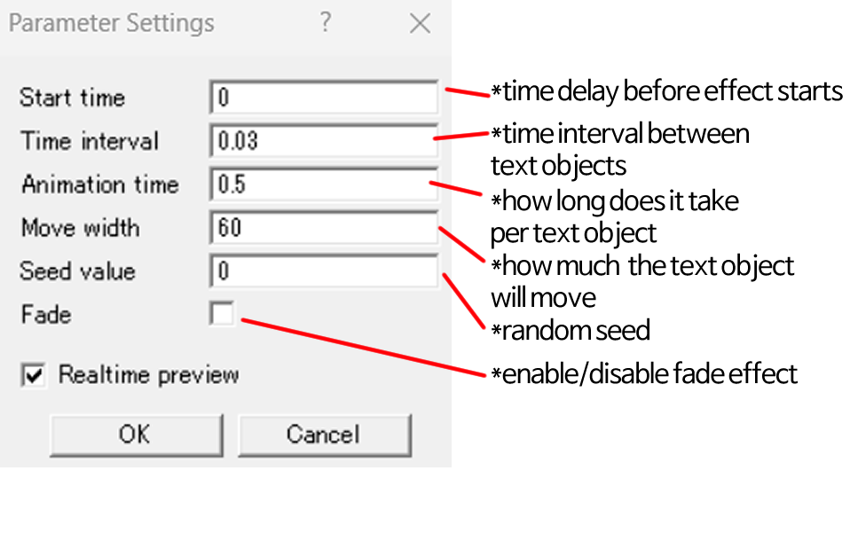

# Random 8-direction
The original code is written by Nure500<a href="https://x.com/sdkd500/status/1084705524459819008"> (link)</a> 
 Thank you so much Nure500 for giving me permission to edit the code

## Description
This renewed script now has fading option. The fade would be applied if fade option is enabled.

## How to Install

1. Download Random 8-direction_in.anm and Random 8-direction_out.anm
2. Put two anm file into script/nure500_anmiation
