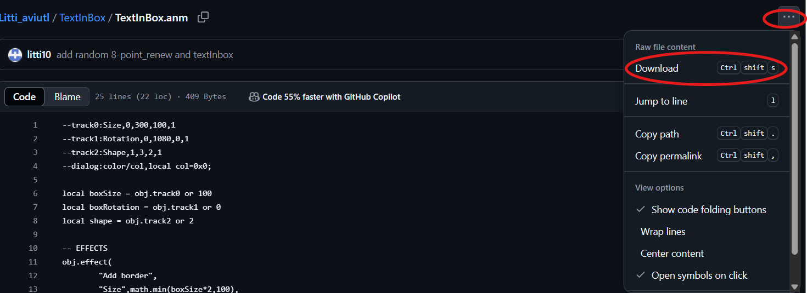

# TextInBox
## Description
Creates a box that wraps the text object

## Environment
Aviutl 1.10 English version by Webcam <a href="https://hapsung.tistory.com/24">(link)</a>

## How to install
1. Create a folder named "Litti" in Script folder

2. Download <a href="https://github.com/litti10/Litti_aviutl/blob/main/TextInBox/TextInBox.anm">TextInBox.anm</a> file into the folder

## How to Use
Trackbar:
<ul>
  <li>Size: changes size of the box wrapping the text. If the box is too small, text will be cut</li>
  <li>Rotation: changes rotation the box</li>
  <li>Shape: changes the shape of the box. 1-> circle / 2 -> square / 3 -> triangle</li>
</ul>
Dialog:
<ul>
  <li>color: change the color of the box</li>
</ul>